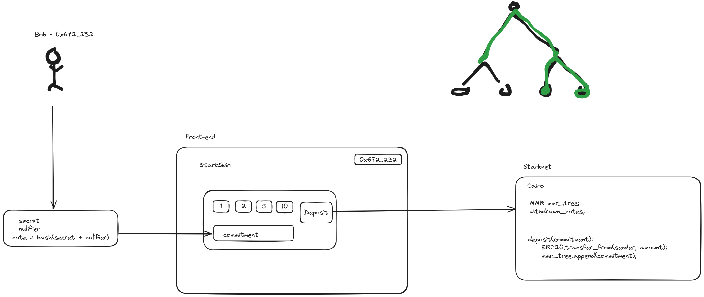
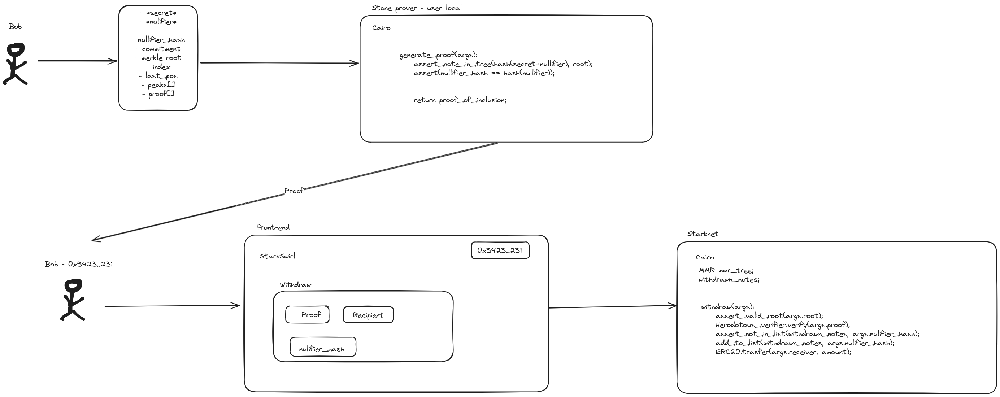

# StarkSwirl


StarkSwirl is a privacy preserving token mixer that allow users to use the public blockchain Starknet and keep their privacy.


In order to interact with the application you need to generate two secret numbers, you can do that on the web page, or you can use another random number generator that you trust. These two random numbers will be hashed together and will be send to the on-chain contract together with the tokens. The user should keep the numbers into a safe place because they will be used in the withdrawal process. Submitting just the hash of these numbers nobody can guess the numbers, or revert the hash, this property is called collision-resistant. Now the deposit is complete.

When the user want to withdraw the tokens from the contract he can do it from another wallet an nobody could link these two wallets. In order to withdraw, the user will input the secret numbers into a local script that he will run on his trusted computer. Nobody can see these numbers, but the script will generate a zk proof that will attend the fact that the user know two numbers that when are hashed together it will result in a specific hash that is stored on-chain in a merkle tree in the contract.
With this proof and nothing more, the user can withdraw tokens from any address that he want, without revealing any information that will link to the initial deposit address

### Step 1: Compile and run the program to generate the prover input files:
```bash
cd tools && ./cairo1-run ../src/lib.cairo \
    --layout recursive \
    --air_public_input ../public_input.json \
    --air_private_input ../private_input.json \
    --trace_file ../trace \
    --memory_file ../memory \
    --proof_mode
    --args '[10, 11, "1129815197211541481934112806673325772687763881719835256646064516195041515616", "2786116088662035069066189777680990419908396521409751409107279532930231316343", "1715556295878999972957474070461491436465516895623517391664966219403971354436", 1, 8, ["1953494062994346031473676762198846975365628378496072945247633132004575093152", "126113334767614658176188594640568076708777092902948464648204141774749582367"], ["2786116088662035069066189777680990419908396521409751409107279532930231316343", "3144957507973559441671210571674558258320337923190994230670584137810138721781"]]'
cd ../
```

### Step 2: Generate the cpu_air_params
```bash
python3 ./tools/fri_step_list.py public_input.json ./tools/new_cpu_air_params.json
```

### Step 3: Run the prover:

```bash
cd tools && ./cpu_air_prover \
    --out_file ../proof.json \
    --private_input_file ../private_input.json \
    --public_input_file ../public_input.json \
    --prover_config_file ./cpu_air_prover_config.json \
    --parameter_file cpu_air_params.json \
    --generate_annotations

cd ../
```
Now you can take the proof.json and submit it to the StarkSwirl web and make the withdraw


## If you want to test the proof locally here is what you need to do

#### Finally, run the verifier to verify the proof:
```bash
cd tools

./cpu_air_verifier --in_file=../proof.json && echo "Successfully verified example proof."

cd ../
```


#### Check on local with Herodotous verifier

Running the verifier locally

```bash
cd tools/herodotous && ./runner --program cairo_verifier.sierra.json -c cairo1 < ../../proof.json

cd ../../
```


#### Check on-chain with Herodotous Starknet Proof Verification
```bash
cd tools/herodotous && ./snfoundry_proof_serializer -c cairo1 <  ../../fibonacci_proof.json > ../../calldata

./1-verify-proof.sh 0x274d8165a19590bdeaa94d1dd427e2034462d7611754ab3e15714a908c60df7 ../../calldata

cd ../../
```


## Deposit flow



## Withdraw flow

